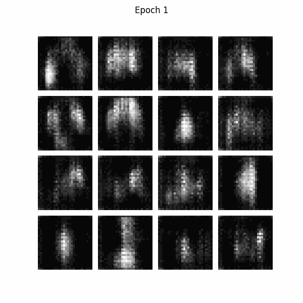

# Generative Adversarial Networks (GANs) com Fashion MNIST

> Este projeto foi desenvolvido para fins de estudo e experimentação no contexto de uma disciplina de Inteligência Artificial.
> 
> São trabalhados dois modelos de redes adversariais generativas - **Vanilla GAN** e **Deep Convolutional GAN (DCGAN)** - comparando seus desempenhos na geração de imagens sintéticas.
> 
> A aplicação utiliza o dataset **Fashion MNIST**, com implementação em **TensorFlow** e **Keras**.

 

## 🧠 Contexto GANs
As Redes Adversariais Generativas (GANs) são aplicações de aprendizado profundo em que dois modelos de redes neurais — o gerador e o discriminador — são treinados simultaneamente em um processo competitivo. O gerador tem como objetivo produzir dados sintéticos (por exemplo, imagens) que se aproximem o máximo possível dos dados reais, enquanto o discriminador busca distinguir entre amostras reais e falsas.

Essa dinâmica de competição promove um aprendizado adversarial, no qual o gerador melhora continuamente sua capacidade de enganar o discriminador, e este, por sua vez, aprimora sua habilidade de categorizar os dados. Desta forma, o desempenho ideal é alcançado através do equilíbrio de aprendizado entre ambos os modelos, mantendo o desafio e possibilidade de geração de amostras cada vez mais realistas.

 

## 📚 Estrutura do notebook
O projeto foi desenvolvido integralmente em um único notebook no Google Colab, no qual as seções principais são:
1. **Importação de bibliotecas**
   - Importação das bibliotecas necessárias para a implementação e treinamento dos modelos.
2. **Importação do dataset Fashion MNIST**
   - Carregamento do dataset e exemplificação visual da estrutura das imagens que compõem as classes de roupas e acessórios.
3. **Ajuste dos dados**
   - Normalização da escala de cores das imagens.
   - Conversão do dataset para o formato do TensorFlow.
   - Criação de batches para o processo de treinamento.
4. **Funções de perda e otimizaçdores**
    - Configuração das funções de perda por entropia cruzada binária para o discriminador e o gerador.
   - Aplicação do otimizador **Adam**.
5. **Funções de treino e parâmetros**
   - Definição dos parâmetros de treinamento (número de épocas, tamanho de ruído, quantidade de imagens geradas).
   - Definição da seed aleatória para visualização de progresso de forma consistente.
   - Implementação da função `train_step()`, responsável por executar uma etapa de treinamento do modelo GAN.  
   - Implementação da função `train()`, que executa o ciclo completo de treinamento.
6. **Funções auxiliares**
   - Função para geração de gráfico (perda do discriminador x gerador) após o treinamento.
   - Função para ajustar e salvar as imagens geradas durante o treinamento do modelo gerador, usadas na criação do GIF final.
7. **Aplicação do Vanilla GAN**
   - Construção e treinamento dos modelos gerador e discriminador.
   - Visualização do gráfico de desempenho.
   - Geração e exibição do GIF com as imagens produzidas.
8. **Aplicação do DCGAN**
   - Construção e treinamento dos modelos gerador e discriminador.
   - Visualização do gráfico de desempenho.
   - Geração e exibição do GIF com as imagens produzidas.

 

## 🚀 Como executar

1. Abra o notebook no Colab:

2. Ative GPU no ambiente de execução: `Runtime > Change runtime type > Hardware accelerator > GPU`

3. Execute as células sequencialmente para:
   - Carregar e preparar os dados (Fashion MNIST)
   - Treinar os modelos Vanilla GAN e DCGAN
   - Visualizar gráficos de perda e imagens geradas

4. É possível ajustar os parâmetros de aprendizado, número de épocas e tamanho do vetor de ruído para observar diferentes comportamentos no treinamento.

 

## 🖼️ Resultados

### - Vanilla GAN
Para ambos os modelos, os parâmetros do otimizador **Adam** foram ajustados para: `learning_rate=2e-4`, `beta_1=0.5`. O treinamento foi realizado por **10 épocas**.

**GIF das imagens geradas pelo Vanilla GAN:**  

### - DCGAN 
Os parâmetros do otimizador **Adam** foram ajustados para: `learning_rate=7e-5` (gerador), `learning_rate=2e-4` (discriminador), `beta_1=0.5` (ambos). O treinamento foi realizado por **10 épocas**.

**GIF das imagens geradas pelo Vanilla GAN:**  

 

## 🔗 Referências

- [Idiot Developer - Vanilla GAN in TensorFlow](https://idiotdeveloper.com/vanilla-gan-in-tensorflow/)  
- [TensorFlow - DCGAN Tutorial](https://www.tensorflow.org/tutorials/generative/dcgan?hl=pt-br)  
- [Fashion MNIST Dataset](https://www.tensorflow.org/tutorials/keras/classification?hl=pt-br)

